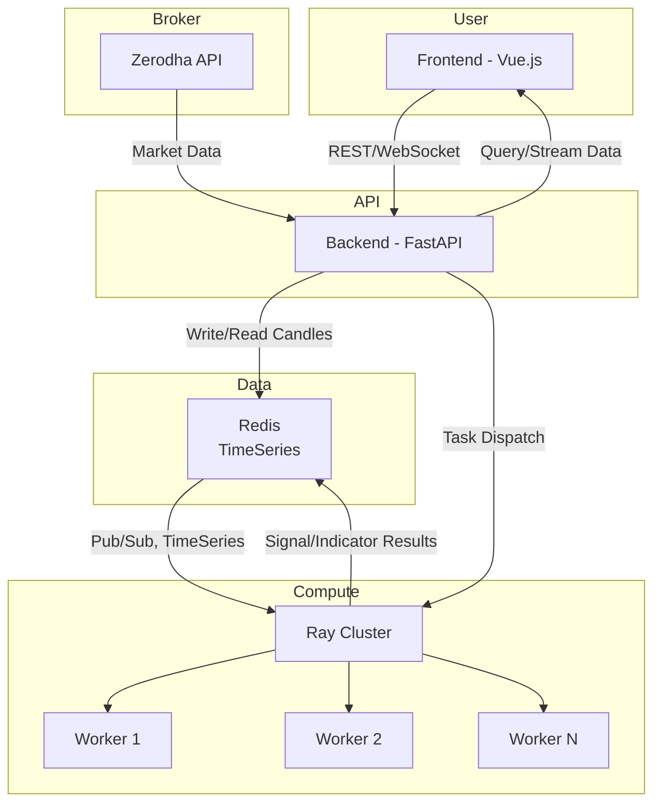

# Next Gen Trading Engine

A full-stack trading dashboard for live and historical market data visualization, featuring a Vue.js frontend with real-time charting and a Python backend with Zerodha integration and Redis storage.

Designed to be the core engine for AI trading bots—enabling lightning-fast execution, real-time signal generation, position management, and rapid strategy development and deployment.

---

## Features

- **Live & Historical Charting**: Interactive candlestick charts with infinite scroll for historical data and real-time updates.
- **Real-Time Polling & Upsert**: Frontend polls for the latest candles every second (configurable), upserting all of today's data to ensure accuracy and deduplication.
- **Scroll-Back Pagination**: Load older candles by scrolling left; chart preserves your scroll position after data loads, for a seamless experience.
- **Backend Sync**: Python backend fetches both historical and real-time data from Zerodha, stores in Redis, and serves via a fast REST API.
- **Partitioned Data Fetching**: Backend supports a partition timestamp to precisely coordinate historical and real-time sync, avoiding overlap or gaps.
- **Multi-Symbol, Multi-Timeframe**: Easily add/remove charts for different symbols and timeframes from the UI.
- **Customizable Polling Interval**: Adjust how frequently the frontend polls for new data.
- **Accurate Data Handling**: Today's candles are always upserted, so late-arriving or corrected data is reflected instantly.
- **Real-Time Indicators & Signal Generation**: Compute indicators and generate trading signals in real time using the cached data in Redis.
- **Responsive UI**: Built with Vue 3 and Vite for fast, modern, and mobile-friendly charting.
- **Extensible Architecture**: Modular Python and Vue codebase, easy to extend for new brokers, strategies, or chart types.
- **Open Source & Developer Friendly**: No vendor lock-in, easy to self-host, and well-documented for rapid onboarding.

---


## System Architecture

> **Note:** The following Mermaid diagram is GitHub-compatible. For best results, view this README on GitHub.



---


## Why This Bot is Better Than Any Other in the Market

- **True Real-Time Upsert**: Unlike most dashboards that only append new candles, this bot upserts all of today's data on every poll, ensuring you always see the most accurate and up-to-date chart—even if the broker corrects or backfills data.
- **Scroll Position Preservation**: When you scroll back to load historical data, your view is preserved, making deep analysis and backtesting much more user-friendly.
- **Partitioned Sync for Zero Data Loss**: The backend's partition timestamp logic ensures there are no gaps or overlaps between historical and real-time data, a common problem in other solutions.
- **Full Transparency & Extensibility**: 100% open source, with a modular codebase. You can audit, extend, or self-host without restrictions.
- **Multi-Symbol, Multi-Timeframe, Multi-Chart**: Instantly add or remove charts for any supported symbol or timeframe, with independent polling and pagination.
- **Lightning Fast & Lightweight**: Uses Redis for blazing-fast data access and Vue 3 + Vite for a snappy frontend experience.
- **Plug-and-Play for Zerodha**: Out-of-the-box support for Zerodha, with easy extension to other brokers.
- **Developer Experience First**: Clean code, clear documentation, and a focus on making it easy for you to build, debug, and extend.
- **No Vendor Lock-In, No Hidden Fees**: Unlike commercial charting solutions, you control your data, your infra, and your roadmap.

---

## Why Algorithmic Trading is Difficult on Broker Platforms

- **Limited APIs & Rate Limits**: Most broker platforms restrict API access, enforce strict rate limits, and provide limited historical data, making robust backtesting and live trading hard.
- **Latency & Delays**: Broker dashboards and APIs often introduce significant latency, which can be fatal for high-frequency or low-latency strategies.
- **Lack of Customization**: Broker UIs are closed-source and inflexible, making it impossible to add custom indicators, strategies, or data sources.
- **Vendor Lock-In**: Data and logic are tied to the broker's infrastructure, making migration or integration with other tools difficult.
- **Poor Data Quality**: Many platforms do not upsert/correct historical data, leading to inaccurate backtests and live signals.
- **No True Real-Time Sync**: Most dashboards only append new data, missing corrections or late-arriving candles.
- **Scalability Issues**: Broker dashboards are not designed for running multiple strategies, symbols, or timeframes in parallel.

---

## How This Project Solves Those Challenges

- **Full Data Ownership**: All data is stored in your own Redis instance, not on a broker's server. You can export, analyze, or migrate it as you wish.
- **Ultra-Low Latency**: Direct integration with Redis and efficient polling means you get the latest data with minimal delay.
- **Customizable & Extensible**: Add your own indicators, strategies, or even new broker integrations with minimal effort.
- **Accurate & Reliable**: Upsert logic ensures your charts and strategies always use the most accurate, corrected data available.
- **No Vendor Lock-In**: 100% open source and self-hosted—migrate, fork, or extend as needed.
- **Parallel & Scalable**: Run multiple charts, symbols, and strategies in parallel, with independent polling and data streams.
- **Modern, Lightweight Stack**: Vue 3 + Vite frontend and Python FastAPI backend are easy to deploy, scale, and maintain.

---

## Data Architecture & Real-Time Analytics

- **Redis as a Mirror for All Data**: The backend maintains a complete mirror of both historical and real-time market data in Redis. Every candle, tick, and update is cached, ensuring instant access for both the frontend and any analytics or trading logic.
- **Unified Data for Indicators & Signals**: Because all data (historical and real-time) is available in Redis, you can compute indicators (like moving averages, RSI, SuperTrend, etc.) and generate trading signals in real time, without waiting for slow API calls or risking missing data.
- **Real-Time Signal Generator**: The architecture is designed to support real-time signal generation—run your strategies directly on the cached data, and trigger alerts or trades with minimal latency.
- **Extensible for Custom Analytics**: Add your own indicator calculations, signal logic, or even machine learning models, all powered by the fast, unified Redis cache.
- **Consistent Data for All Consumers**: Whether it's the chart UI, a backtest, or a live trading bot, all components read from the same, up-to-date data source.

---


**Legend:**
- **Frontend (Vue.js):** User interface for charts, controls, and live data.
- **Backend (FastAPI):** Handles API requests, data ingestion, and orchestration.
- **Redis (TimeSeries):** Stores all historical and real-time candles, supports fast queries and pub/sub.
- **Ray Cluster:** Distributed compute for real-time indicators, signal generation, and heavy analytics.
- **Workers:** Each Ray worker can run a strategy, indicator, or ML model in parallel.
- **Zerodha API:** Source of live and historical market data.

---

## Lightweight & Scalable by Design

- **Minimal Resource Usage**: The backend is stateless and leverages Redis for fast, in-memory data access. The frontend is a single-page app built for speed.
- **Horizontal Scalability**: Easily scale out by running multiple backend or frontend instances behind a load balancer.
- **Cloud & Local Ready**: Deploy on your laptop, a cloud VM, or a Kubernetes cluster—no heavy dependencies or vendor lock-in.
- **Designed for Growth**: Add more symbols, timeframes, or users without a performance hit.

---

## Project Structure

```
.
├── brokers/                # Zerodha and broker integration logic
├── core/                   # Core trading/aggregation logic
├── dashboard/              # Backend dashboard and visualization
├── storage/                # Redis and data storage utilities
├── strategies/             # Trading strategies
├── tradingview_dashboard/
│   ├── backend/            # FastAPI backend (main.py)
│   └── frontend/           # Vue 3 + Vite frontend
├── config/                 # Configuration files
├── README.md               # This file
├── docker-compose.yml      # (Optional) Docker setup
└── ...
```

---

## Setup Instructions

### 1. Backend (Python, FastAPI)

- **Install dependencies (using [uv](https://github.com/astral-sh/uv))**:
  ```bash
  uv pip install -r requirements.txt
  ```

- **Environment variables**:  
  Copy `sample_env` to `.env` and fill in your Zerodha credentials and Redis config.

- **Run Redis**:  
  Make sure Redis is running (locally or via Docker).

- **Start backend in development mode**:
  ```bash
  uvicorn tradingview_dashboard.backend.main:app --reload
  ```

### 2. Frontend (Vue 3, Vite)

- **Install dependencies**:
  ```bash
  cd tradingview_dashboard/frontend
  npm install
  ```

- **Run frontend**:
  ```bash
  npm run dev
  ```

- The frontend will be available at [http://localhost:5173](http://localhost:5173) (default Vite port).

---

## Usage

- Open the frontend in your browser.
- Add charts for different symbols and timeframes.
- Scroll left to load older candles; the chart will preserve your scroll position.
- The right side of the chart is kept in sync with the latest data via polling (default: every 1 second).
- Today's candles are always upserted to ensure accuracy.

---

## Development Notes

- **Polling & Upsert**:  
  The frontend polls for all of today's candles and upserts them, replacing any existing candles for today.
- **Partition Timestamp**:  
  The backend supports a `partition_timestamp` for precise coordination between historical and real-time data fetching.
- **Preserving Scroll Position**:  
  When loading older data, the chart maintains the user's scroll position for a seamless experience.

---

## Contributing

Pull requests and issues are welcome! Please open an issue to discuss your ideas or report bugs.

---

## License

[MIT](LICENSE)
